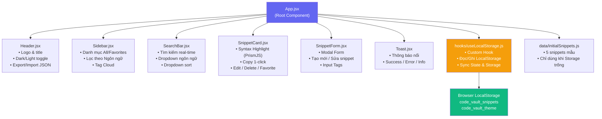

# Kiến trúc hệ thống — Code Snippet & Tech Notes Vault

> **Tài liệu kỹ thuật** mô tả cấu trúc component và luồng dữ liệu của ứng dụng.
> **Công nghệ:** Vite 5.4 + React 19 + JavaScript (ES6+)
> **Cập nhật:** 08/08/2026

---

## 1. Tổng quan kiến trúc

Ứng dụng áp dụng kiến trúc **Single Page Application (SPA)** với mô hình **Component-based** của React. Toàn bộ dữ liệu được lưu tại **Browser LocalStorage** — không cần server backend.

```
┌─────────────────────────────────────────────────────┐
│                    Trình duyệt Web                  │
│                                                     │
│  ┌─────────────────────────────────────────────┐    │
│  │              React SPA (Vite)               │    │
│  │                                             │    │
│  │  ┌──────────────── App.jsx ─────────────┐  │    │
│  │  │  (State: snippets, filters, theme)   │  │    │
│  │  │  (Handlers: CRUD, export, import)    │  │    │
│  │  └──┬────────┬──────────┬──────────────┘  │    │
│  │     │        │          │                  │    │
│  │  ┌──▼──┐ ┌───▼───┐ ┌───▼───────────────┐  │    │
│  │  │Hdr  │ │Sidebar│ │  Main Content      │  │    │
│  │  └─────┘ └───────┘ │  ┌─────────────┐  │  │    │
│  │                    │  │  SearchBar  │  │  │    │
│  │                    │  └─────────────┘  │  │    │
│  │                    │  ┌─────────────┐  │  │    │
│  │                    │  │SnippetGrid  │  │  │    │
│  │                    │  │ ┌─────────┐ │  │  │    │
│  │                    │  │ │Snippet  │ │  │  │    │
│  │                    │  │ │Card x N │ │  │  │    │
│  │                    │  │ └─────────┘ │  │  │    │
│  │                    │  └─────────────┘  │  │    │
│  │                    └───────────────────┘  │    │
│  │                                           │    │
│  │  ┌─────────────────────────────────────┐  │    │
│  │  │    hooks/useLocalStorage.js         │  │    │
│  │  │    (Đồng bộ State ↔ LocalStorage)  │  │    │
│  │  └─────────────────────────────────────┘  │    │
│  └─────────────────────────────────────────────┘    │
│                         │                           │
│  ┌──────────────────────▼──────────────────────┐    │
│  │          Browser LocalStorage               │    │
│  │   Key: "code_vault_snippets" (Snippet[])    │    │
│  │   Key: "code_vault_theme" ("dark"/"light")  │    │
│  └─────────────────────────────────────────────┘    │
└─────────────────────────────────────────────────────┘
```

---

## 2. Sơ đồ Component (Mermaid)



---

## 3. Luồng dữ liệu (Data Flow)

```
[Người dùng tương tác]
        │
        ▼
[React Component (SnippetForm / SearchBar / SnippetCard)]
        │
        │  Dispatch event (onClick, onChange, onSubmit)
        ▼
[Handler function trong App.jsx]
  - handleSaveSnippet()
  - handleDeleteSnippet()
  - handleToggleFavorite()
  - handleExportData()
  - handleImportData()
        │
        │  setSnippets(updatedData)
        ▼
[React State: snippets (Snippet[])]
        │
        │  useEffect → localStorage.setItem()
        ▼
[Browser LocalStorage]
        │
        │  (Tự động khi mount) localStorage.getItem()
        ▼
[Hiển thị lại UI qua filteredSnippets (useMemo)]
```

---

## 4. Cấu trúc dữ liệu Snippet Object

```typescript
interface Snippet {
  id: string;           // "snip-1706789012345" (timestamp-based unique ID)
  title: string;        // "React Custom Hook: useLocalStorage"
  language: string;     // "javascript" | "python" | "cpp" | "java" | "sql" | "css" | "typescript" | "json"
  code: string;         // Nội dung mã nguồn (raw text)
  description: string;  // Mô tả ngắn về đoạn code
  tags: string[];       // ["react", "hooks", "frontend"]
  isFavorite: boolean;  // true | false
  createdAt: string;    // ISO 8601: "2026-07-20T09:30:00.000Z"
}
```

---

## 5. Các thư viện bên ngoài (Dependencies)

| Thư viện | Phiên bản | Mục đích |
| :--- | :---: | :--- |
| **react** | ^19.2.7 | Framework UI chính |
| **react-dom** | ^19.2.7 | Render React vào DOM |
| **prismjs** | ^1.x | Tô màu cú pháp (Syntax Highlighting) cho 8+ ngôn ngữ |
| **lucide-react** | ^0.x | Bộ icons SVG (Search, Copy, Trash, Edit, Star...) |
| **vite** (dev) | ^5.4.11 | Build tool & Dev server |
| **@vitejs/plugin-react** (dev) | ^4.3.4 | Plugin Vite cho React Fast Refresh |

---

## 6. Cấu hình build (vite.config.js)

```javascript
import { defineConfig } from 'vite';
import react from '@vitejs/plugin-react';

export default defineConfig({
  plugins: [react()]
});
```

**Kết quả build production:**
- `dist/index.html` — 0.47 KB (gzip: 0.30 KB)
- `dist/assets/index-*.css` — 10.94 KB (gzip: 3.07 KB)
- `dist/assets/index-*.js` — 261.29 KB (gzip: 82.29 KB)
